<p align="center">
  
</p>

# JVectorCUDA

A Java library for CUDA-accelerated vector similarity search.

[](https://github.com/michaelangelo23/jvectorcuda/actions/workflows/ci.yml)
[](https://github.com/michaelangelo23/jvectorcuda/actions/workflows/codeql.yml)
[](LICENSE)
[](https://github.com/michaelangelo23/jvectorcuda/stargazers)
[](https://github.com/michaelangelo23/jvectorcuda/network)
[](https://github.com/michaelangelo23/jvectorcuda/commits/master)

---

## Table of Contents

- [Capabilities](#capabilities)
- [How Does It Work?](#how-does-it-work)
- [Requirements](#requirements)
- [Installation](#installation)
  - [Using JitPack](#using-jitpack)
  - [Building from Source](#building-from-source)
- [Usage](#usage)
  - [Quick Start](#quick-start)
  - [Index Types](#index-types)
  - [Distance Metrics](#distance-metrics)
  - [Thread Safety](#thread-safety)
- [Benchmarks](#benchmarks)
- [Development](#development)
  - [Setup](#setup)
  - [Build](#build)
  - [Run Tests](#run-tests)
  - [Run Benchmarks](#run-benchmarks)
- [Get Involved](#get-involved)
- [License](#license)

---

## Capabilities

- **GPU-accelerated search**: Offload nearest neighbor search to NVIDIA GPUs via CUDA
- **Intelligent routing**: Hybrid index automatically routes single queries → CPU, batch queries → GPU
- **Multiple distance metrics**: Euclidean, Cosine, and Inner Product similarity
- **Automatic fallback**: Works without GPU (gracefully falls back to CPU)
- **Memory efficient**: Persistent GPU memory mode for repeated queries on same dataset
- **Thread-safe options**: Built-in synchronized wrappers for concurrent access
- **Pure Java API**: No JNI code to write - uses JCuda bindings

---

## How Does It Work?

```
┌─────────────────────────────────────────────────────────────┐
│                     Your Application                         │
└─────────────────────────────────────────────────────────────┘
### Architecture Overview

```mermaid
flowchart TB
    App["🖥️ Your Application"]
    
    subgraph API["JVectorCUDA API"]
        direction LR
        VectorIndex["VectorIndex"]
        SearchResult["SearchResult"]
        Factory["VectorIndexFactory"]
    end
    
    subgraph Implementations["Index Implementations"]
        direction LR
        CPU["CPUIndex<br/>(HNSW)"]
        GPU["GPUIndex<br/>(CUDA Brute-Force)"]
        Hybrid["HybridIndex<br/>(Auto-Route)"]
    end
    
    subgraph CUDAStack["CUDA Stack"]
        direction TB
        Kernels["📄 CUDA Kernels<br/>(PTX Files)"]
        NVGPU["🎮 NVIDIA GPU<br/>(Compute 6.1+)"]
    end
    
    App --> API
    API --> Implementations
    
    GPU --> CUDAStack
    Hybrid -.-> CPU
    Hybrid -.-> GPU
    
    Kernels --> NVGPU
    
    style App fill:#e1f5ff
    style API fill:#fff3cd
    style Implementations fill:#d4edda
    style CUDAStack fill:#f8d7da
    style Hybrid fill:#d1ecf1,stroke:#0c5460,stroke-width:3px
```



### Routing Decision Flow

```mermaid
flowchart LR
    Start([Query Request])
    
    Start --> IndexType{Index Type?}
    
    IndexType -->|Hybrid ⭐| Smart{Batch Size?}
    IndexType -->|Auto| GPUCheck{GPU Available?}
    IndexType -->|CPU| CPUPath[CPU: HNSW<br/>~89ms/query]
    IndexType -->|GPU| GPUPath[GPU: CUDA<br/>~5ms/query<br/>+transfer cost]
    
    Smart -->|Single| CPUPath
    Smart -->|≥10 queries| GPUPath
    
    GPUCheck -->|Yes| GPUPath
    GPUCheck -->|No| CPUPath
    
    CPUPath --> Result([SearchResult])
    GPUPath --> Result
    
    style Smart fill:#d1ecf1,stroke:#0c5460,stroke-width:2px
    style CPUPath fill:#d4edda
    style GPUPath fill:#f8d7da
    style Result fill:#fff3cd
```



**Key Points:**
- **HybridIndex** (recommended) intelligently routes based on workload
- **CPUIndex** uses HNSW approximation for low-latency single queries
- **GPUIndex** uses brute-force exact search for high-throughput batches
- **Auto** selects GPU if available, otherwise falls back to CPU

---

## Requirements


| Requirement | Details |
|-------------|---------|
| **Java** | 17 or higher (tested up to 25) |
| **NVIDIA Driver** | 11.8+ (run `nvidia-smi` to check) |
| **GPU** | GTX 1060+ / RTX series / Tesla P4+ (Compute 6.1+) |

> **Note:** No CUDA Toolkit installation required - just the GPU driver!

---

## Installation

### Using JitPack

[](https://jitpack.io/#michaelangelo23/jvectorcuda)

**Gradle:**
```gradle
repositories {
    maven { url 'https://jitpack.io' }
}

dependencies {
    implementation 'com.github.michaelangelo23:jvectorcuda:v1.0.0'
}
```

**Maven:**
```xml
<repositories>
    <repository>
        <id>jitpack.io</id>
        <url>https://jitpack.io</url>
    </repository>
</repositories>

<dependency>
    <groupId>com.github.michaelangelo23</groupId>
    <artifactId>jvectorcuda</artifactId>
    <version>v1.0.0</version>
</dependency>
```

### Building from Source

```bash
git clone https://github.com/michaelangelo23/jvectorcuda.git
cd jvectorcuda

# Download JCuda dependencies
.\scripts\setup-jcuda.ps1   # Windows
./scripts/setup-jcuda.sh    # Linux/macOS

# Build
./gradlew build
```

---

## Usage

### Quick Start

```java
import com.vindex.jvectorcuda.*;

// Create a hybrid index (recommended)
try (VectorIndex index = VectorIndexFactory.hybrid(384)) {
    
    // Add vectors
    float[][] embeddings = getEmbeddings(); // Your embedding vectors
    index.add(embeddings);
    
    // Single query → automatically uses CPU (lower latency)
    float[] query = getQueryVector();
    SearchResult result = index.search(query, 10);
    
    // Batch queries → automatically uses GPU (higher throughput)
    float[][] queries = getQueryBatch();
    List<SearchResult> results = index.searchBatch(queries, 10);
    
    // Access results
    for (int i = 0; i < result.indices().length; i++) {
        System.out.printf("Neighbor %d: index=%d, distance=%.4f%n",
            i, result.indices()[i], result.distances()[i]);
    }
}
```

### Index Types

| Factory Method | Description | Best For |
|----------------|-------------|----------|
| `hybrid(dims)` | Auto-routes between CPU/GPU | General use (recommended) |
| `auto(dims)` | GPU if available, else CPU | Simple GPU acceleration |
| `cpu(dims)` | Force CPU only | Testing, small datasets |
| `gpu(dims)` | Force GPU only | Maximum GPU throughput |

```java
// Hybrid: intelligent routing
VectorIndex hybrid = VectorIndexFactory.hybrid(384);

// Auto: GPU with CPU fallback  
VectorIndex auto = VectorIndexFactory.auto(384);

// Force specific backend
VectorIndex cpu = VectorIndexFactory.cpu(384);
VectorIndex gpu = VectorIndexFactory.gpu(384);
```

### Distance Metrics

```java
import com.vindex.jvectorcuda.DistanceMetric;

// Euclidean distance (default)
VectorIndex euclidean = VectorIndexFactory.hybrid(384, DistanceMetric.EUCLIDEAN);

// Cosine similarity  
VectorIndex cosine = VectorIndexFactory.hybrid(384, DistanceMetric.COSINE);

// Inner product (dot product)
VectorIndex innerProduct = VectorIndexFactory.hybrid(384, DistanceMetric.INNER_PRODUCT);
```

### Thread Safety

By default, indexes are **not thread-safe**. For concurrent access:

```java
// Thread-safe variants
VectorIndex safe = VectorIndexFactory.hybridThreadSafe(384);
VectorIndex safeAuto = VectorIndexFactory.autoThreadSafe(384);
VectorIndex safeCpu = VectorIndexFactory.cpuThreadSafe(384);
VectorIndex safeGpu = VectorIndexFactory.gpuThreadSafe(384);
```

---

## Benchmarks

See the [benchmarks folder](benchmarks/) for detailed results.

**Sample Results** (GTX 1080 Max-Q, 384 dimensions, 50K vectors):

| Scenario | CPU | GPU | Winner |
|----------|-----|-----|--------|
| Single query | 81 ms | 240 ms | CPU |
| 10 queries | 319 ms | 208 ms | GPU |
| 100 queries | 2903 ms | 733 ms | **GPU (4x)** |

> **Takeaway:** GPU wins for batch queries (10+) on larger datasets (10K+ vectors).

Run your own benchmarks:
```bash
./gradlew benchmark
```

---

## Development

### Setup

```bash
# Clone
git clone https://github.com/michaelangelo23/jvectorcuda.git
cd jvectorcuda

# Install JCuda dependencies
.\scripts\setup-jcuda.ps1   # Windows
./scripts/setup-jcuda.sh    # Linux/macOS
```

### Build

```bash
./gradlew build
```

### Run Tests

```bash
./gradlew test
```

### Run Benchmarks

```bash
./gradlew benchmark
```

---

## Get Involved

[](https://github.com/michaelangelo23/jvectorcuda/issues)
[](https://github.com/michaelangelo23/jvectorcuda/pulls)

Contributions are welcome! Whether it's:

- 🐛 Reporting bugs
- 💡 Suggesting features  
- 📖 Improving documentation
- 🔧 Submitting pull requests

See [CONTRIBUTING.md](CONTRIBUTING.md) for guidelines.

---

## License

[Apache License 2.0](LICENSE)
